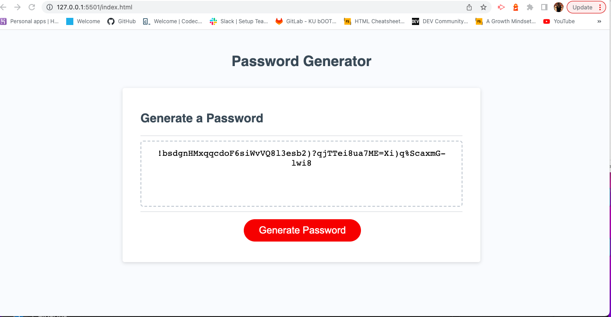

## My Javascript Challenge

## Description 
Within my project, I will be creating an application that will enable emplyees to create a random password. My app will have feautures pf HTML and CSS. The project will be powered by Javascript coding that I will be using.

## Visuals

## Authors and Acknowledgment
I am Jeremiah and I am the author of this project.

I would like to thank Joshua for helping me better understand this project. I was behind at first on learning much more about Javascipt, but I am getting the hang of everything.

 

README is maintained by [Jeremiah](https://github.com/Jwarren619) , followed by the [My-JavaScript-Challenge](https://github.com/Jwarren619/My-JavaScript-Challenge) and hosted on [GitHub](https://github.com/Jwarren619/My-JavaScript-Challenge).

